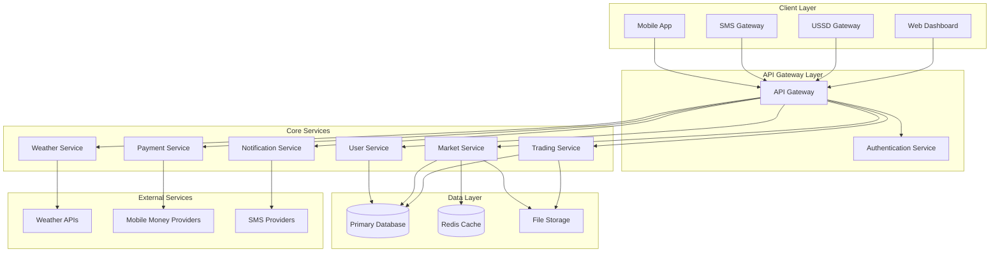

# Design Document

## Overview

The Farmer Market Platform is designed as a cloud-native SaaS solution that provides agricultural market intelligence and direct trading capabilities to smallholder farmers in Uganda. The system employs a microservices architecture to handle multiple communication channels (mobile app, SMS, USSD), real-time data processing, and secure payment transactions through mobile money platforms.

The platform serves three primary user types: farmers, buyers (consumers/retailers/processors), and agricultural extension officers, with a comprehensive admin dashboard for platform management.

## Architecture

### High-Level Architecture



### Technology Stack

- **Frontend/Backend**: Next.js 14 with App Router (React 18, TypeScript)
- **API Routes**: Next.js API routes for backend functionality
- **Database**: PostgreSQL with Prisma ORM for type-safe database access
- **Caching**: Redis for caching and real-time features
- **Authentication**: NextAuth.js with custom phone number provider
- **File Storage**: AWS S3 or Vercel Blob for image uploads
- **Real-time**: WebSockets with Socket.io for live notifications
- **SMS/USSD**: Integration with local telecom providers (MTN, Airtel Uganda)
- **Mobile Money**: MTN Mobile Money API, Airtel Money API
- **Weather Data**: OpenWeatherMap API, local meteorological services
- **Deployment**: Vercel or Docker containers with Next.js production build

## Components and Interfaces

### 1. User Management Service

**Responsibilities:**
- User registration and authentication
- Profile management for farmers, buyers, and extension officers
- Role-based access control
- Multi-channel user preferences

**Key Interfaces:**
```typescript
interface User {
  id: string;
  phoneNumber: string;
  name: string;
  role: 'farmer' | 'buyer' | 'extension_officer' | 'admin';
  location: GeoLocation;
  preferredChannels: ('app' | 'sms' | 'ussd')[];
  subscriptions: Subscription[];
  rating: number;
  isVerified: boolean;
}

interface AuthToken {
  accessToken: string;
  refreshToken: string;
  expiresIn: number;
}
```

### 2. Market Data Service

**Responsibilities:**
- Collect and aggregate market price data
- Validate crowdsourced price submissions
- Generate price trends and analytics
- Cache frequently accessed market data

**Key Interfaces:**
```typescript
interface MarketPrice {
  id: string;
  cropType: string;
  marketLocation: string;
  price: number;
  unit: string;
  quality: 'premium' | 'standard' | 'low';
  timestamp: Date;
  source: 'official' | 'crowdsourced';
  verificationStatus: 'pending' | 'verified' | 'rejected';
  submittedBy?: string;
}

interface PriceTrend {
  cropType: string;
  region: string;
  prices: { date: Date; avgPrice: number }[];
  trend: 'rising' | 'falling' | 'stable';
}
```

### 3. Trading Service

**Responsibilities:**
- Manage product listings from farmers
- Handle buyer searches and filtering
- Facilitate communication between farmers and buyers
- Track transaction status and completion

**Key Interfaces:**
```typescript
interface ProductListing {
  id: string;
  farmerId: string;
  cropType: string;
  quantity: number;
  unit: string;
  quality: string;
  pricePerUnit: number;
  location: GeoLocation;
  harvestDate: Date;
  availableUntil: Date;
  images: string[];
  description: string;
  status: 'active' | 'sold' | 'expired';
}

interface Transaction {
  id: string;
  listingId: string;
  buyerId: string;
  farmerId: string;
  quantity: number;
  totalAmount: number;
  status: 'pending' | 'confirmed' | 'completed' | 'disputed';
  paymentStatus: 'pending' | 'paid' | 'refunded';
  deliveryMethod: 'pickup' | 'delivery';
  createdAt: Date;
}
```

### 4. Payment Service

**Responsibilities:**
- Process mobile money payments
- Handle subscription billing
- Manage escrow for marketplace transactions
- Process refunds and dispute resolutions

**Key Interfaces:**
```typescript
interface Payment {
  id: string;
  userId: string;
  amount: number;
  currency: string;
  provider: 'mtn_mobile_money' | 'airtel_money';
  type: 'subscription' | 'marketplace' | 'refund';
  status: 'pending' | 'completed' | 'failed';
  externalTransactionId: string;
  metadata: Record<string, any>;
}

interface Subscription {
  id: string;
  userId: string;
  plan: 'basic' | 'premium';
  status: 'active' | 'expired' | 'cancelled';
  startDate: Date;
  endDate: Date;
  autoRenew: boolean;
}
```

### 5. Notification Service

**Responsibilities:**
- Send multi-channel notifications (push, SMS, USSD)
- Manage notification preferences
- Handle real-time price alerts
- Queue and retry failed notifications

**Key Interfaces:**
```typescript
interface Notification {
  id: string;
  userId: string;
  type: 'price_alert' | 'weather_warning' | 'transaction_update';
  channels: ('push' | 'sms' | 'ussd')[];
  content: {
    title: string;
    message: string;
    data?: Record<string, any>;
  };
  status: 'pending' | 'sent' | 'failed';
  scheduledAt?: Date;
}
```

### 6. Weather Service

**Responsibilities:**
- Fetch weather forecasts from external APIs
- Generate location-specific agricultural advice
- Send weather alerts and warnings
- Cache weather data for performance

**Key Interfaces:**
```typescript
interface WeatherForecast {
  location: GeoLocation;
  date: Date;
  temperature: { min: number; max: number };
  humidity: number;
  rainfall: number;
  windSpeed: number;
  conditions: string;
  agriculturalAdvice: string[];
}

interface WeatherAlert {
  id: string;
  region: string;
  alertType: 'severe_weather' | 'drought' | 'flood';
  severity: 'low' | 'medium' | 'high';
  message: string;
  validUntil: Date;
}
```

## Data Models

### Core Entities

**Users Table:**
```sql
CREATE TABLE users (
  id UUID PRIMARY KEY DEFAULT gen_random_uuid(),
  phone_number VARCHAR(20) UNIQUE NOT NULL,
  name VARCHAR(100) NOT NULL,
  role user_role NOT NULL,
  location POINT,
  preferred_channels TEXT[],
  rating DECIMAL(3,2) DEFAULT 0,
  is_verified BOOLEAN DEFAULT FALSE,
  created_at TIMESTAMP DEFAULT NOW(),
  updated_at TIMESTAMP DEFAULT NOW()
);
```

**Market Prices Table:**
```sql
CREATE TABLE market_prices (
  id UUID PRIMARY KEY DEFAULT gen_random_uuid(),
  crop_type VARCHAR(50) NOT NULL,
  market_location VARCHAR(100) NOT NULL,
  price DECIMAL(10,2) NOT NULL,
  unit VARCHAR(20) NOT NULL,
  quality quality_grade NOT NULL,
  source price_source NOT NULL,
  verification_status verification_status DEFAULT 'pending',
  submitted_by UUID REFERENCES users(id),
  created_at TIMESTAMP DEFAULT NOW(),
  INDEX idx_crop_location_date (crop_type, market_location, created_at)
);
```

**Product Listings Table:**
```sql
CREATE TABLE product_listings (
  id UUID PRIMARY KEY DEFAULT gen_random_uuid(),
  farmer_id UUID NOT NULL REFERENCES users(id),
  crop_type VARCHAR(50) NOT NULL,
  quantity DECIMAL(10,2) NOT NULL,
  unit VARCHAR(20) NOT NULL,
  quality VARCHAR(50),
  price_per_unit DECIMAL(10,2) NOT NULL,
  location POINT NOT NULL,
  harvest_date DATE,
  available_until DATE,
  images TEXT[],
  description TEXT,
  status listing_status DEFAULT 'active',
  created_at TIMESTAMP DEFAULT NOW(),
  INDEX idx_crop_location (crop_type, location),
  INDEX idx_status_date (status, created_at)
);
```

### Relationships

- Users can have multiple subscriptions and transactions
- Market prices are linked to submitting users for crowdsourced data
- Product listings belong to farmer users
- Transactions connect buyers, farmers, and listings
- Notifications are sent to specific users based on preferences

## Error Handling

### Error Categories

1. **Validation Errors (400)**
   - Invalid phone number format
   - Missing required fields
   - Invalid price or quantity values

2. **Authentication Errors (401/403)**
   - Invalid or expired tokens
   - Insufficient permissions for role-based actions

3. **Business Logic Errors (422)**
   - Insufficient subscription for premium features
   - Attempting to buy own products
   - Invalid payment amount or currency

4. **External Service Errors (502/503)**
   - Mobile money provider failures
   - Weather API unavailability
   - SMS gateway timeouts

5. **System Errors (500)**
   - Database connection failures
   - Unexpected application errors

### Error Response Format

```typescript
interface ErrorResponse {
  error: {
    code: string;
    message: string;
    details?: Record<string, any>;
    timestamp: string;
  };
}
```

### Retry and Fallback Strategies

- **Payment Processing**: Retry failed mobile money transactions up to 3 times with exponential backoff
- **Notifications**: Queue failed SMS/push notifications for retry, fallback to alternative channels
- **Weather Data**: Cache last successful weather data, serve cached data if API is unavailable
- **Market Data**: Implement circuit breaker pattern for external market data sources

## Testing Strategy

### Unit Testing
- Service layer business logic testing with Jest
- Database model validation and constraint testing
- API endpoint input/output validation
- Mock external service dependencies

### Integration Testing
- End-to-end API workflow testing
- Database transaction integrity testing
- Mobile money payment flow testing
- Multi-channel notification delivery testing

### Performance Testing
- Load testing for concurrent user scenarios
- Database query performance optimization
- API response time benchmarking
- Mobile network condition simulation

### Security Testing
- Authentication and authorization flow testing
- Input sanitization and SQL injection prevention
- Rate limiting and DDoS protection testing
- Mobile money transaction security validation

### User Acceptance Testing
- Multi-channel user experience testing (app, SMS, USSD)
- Farmer workflow testing with real agricultural scenarios
- Payment integration testing with actual mobile money accounts
- Accessibility testing for users with varying literacy levels

### Monitoring and Observability

- **Application Metrics**: Response times, error rates, throughput
- **Business Metrics**: User engagement, transaction volumes, subscription rates
- **Infrastructure Metrics**: Database performance, cache hit rates, queue depths
- **External Service Monitoring**: Mobile money API availability, weather service uptime
- **Real-time Alerting**: Critical error notifications, payment failures, system outages